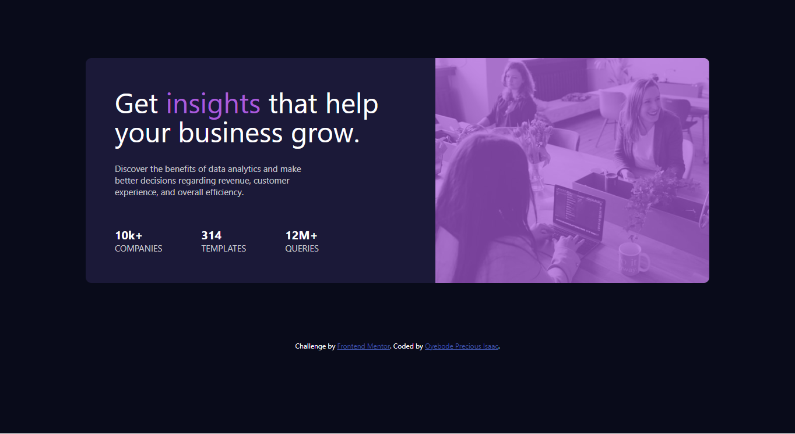

<!-- @format -->

# Frontend Mentor - Stats preview card component solution

This is a solution to the [Stats preview card component challenge on Frontend Mentor](https://www.frontendmentor.io/challenges/stats-preview-card-component-8JqbgoU62). Frontend Mentor challenges help you improve your coding skills by building realistic projects.

## Table of contents

- [Overview](#overview)
  - [The challenge](#the-challenge)
  - [Screenshot](#screenshot)
  - [Links](#links)
- [My process](#my-process)
  - [Built with](#built-with)
  - [What I learned](#what-i-learned)
  - [Continued development](#continued-development)
  - [Useful resources](#useful-resources)
- [Author](#author)
- [Acknowledgments](#acknowledgments)

**Note: Delete this note and update the table of contents based on what sections you keep.**

## Overview

### The challenge

Users should be able to:

- See hover and focus states for all interactive elements on the page
- View the webpage on different size screen (Responsiveness)

### Screenshot




### Links

- Solution URL: (https://github.com/OYEBODEPRECIOUS/stat-preview-card)
- Live Site URL: (https://oyebodeprecious.github.io/stat-preview-card/)

## My process

-

### Built with

- Semantic HTML5 markup
- CSS custom properties
- Flexbox
- CSS Grid
- Desktop first approach
  \*\*

### What I learned

To see how you can add code snippets, see below:

```css
.preview-card {
  display: flex;
  flex-direction: column-reverse;
}
```

If you want more help with writing markdown, we'd recommend checking out [The Markdown Guide](https://www.markdownguide.org/) to learn more.

### Continued development

Learnt how to use colum-reverse

## Author

-Linkedin - [@OyebodePreciousIsaac] (www.linkedin.com/in/oyebode-precious-396a64237)

- Frontend Mentor - [@OYEBODEPRECIOUS](https://www.frontendmentor.io/profile/OYEBODEPRECIOUS)
- Twitter - [@koderzeus](https://x.com/koderzeus)

### Acknoledgements

I give glory to God almighty for giving me the priviledge to see this challenge online which was mentioned by Dillion Megida one of my mentors and also give kudos to OIC Hub and the tutors who taught me HTML and CSS. And also a wonderful applause to myself for completing this project in less than 1 hour.
